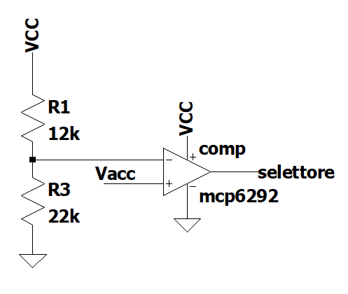
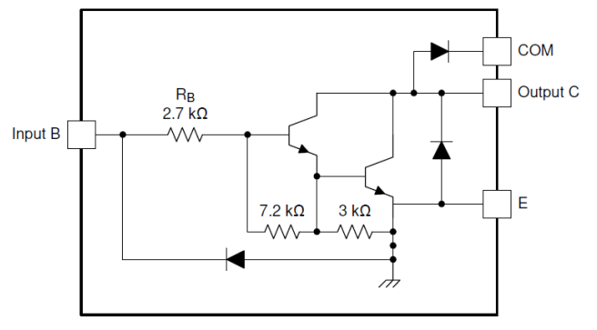

\pagebreak

```{r setup, include=FALSE}
knitr::opts_chunk$set(echo = FALSE)
library(knitr)
library(kableExtra)
library(tidyverse)
library(memor)
library(patchwork)
library(latex2exp)
library(ggplot2)
library(modelr)
library(dplyr)
library(ggExtra)
library(boot)
library(outliers)
# Impostazioni output
knitr::opts_chunk$set(
	fig.align  = "center",        # allineamento figure
	fig.dim    = c(5, 3) * 1, # rapporto larghezza/altezza e fattore di scala
	fig.show   = 'hold',
	results    = 'hold',
	out.height = "2.8in",       # altezza effettiva figure
	message    = FALSE,         # sopprimi messaggi
	warning    = FALSE,         # sopprimi warning
	echo       = FALSE,          # mostra i codice dei chunk
	include    = TRUE,          # mostra l'output dei chunk
	tidy       = TRUE,          # formatta il codice dei chunk
  tidy.opts  = list(width.cutoff=I(60)) # massima larghezza codice nei chunk
)
```

# Introduzione

Con il circuito costruito l'obiettivo è quello di simulare un motore di una macchina capace di accelerare e di frenare, rispetto ad una velocità costante a vuoto, con due pedali, e, in caso di avvicinamento di un ostacolo, di rallentare fino ad arrestarsi quando questo è molto vicino.
I sensori utilizzati per realizzare questo circuito sono tre: due sensori di pressione che fungono da pedali e un sensore a ultrasuoni utilizzato come sensore di prossimità.

# Sensori e motori

## Sensore di pressione *RP-C7.6-ST*
I due sensori utilizzati in questo circuito sono entrambi due *RP-C7.6-ST*. Questo tipo di sensore permette di determinare la forza esercitata su di esso conoscendo la sua resistenza. Man mano che la forza aumenta infatti la resistenza ai capi del sensore diminuisce. La funzione che meglio approssima l'effettiva relazione tra forza e resistenza è questa:
$$
  R = \frac{336.04}{F^{0.721}} 
$$
come raffigurato nella regressione del *data-sheet* in Fig.\ref{fig:regressione}.

```{r regressione, fig.cap="Regressione del sensore RP-C7.6-ST"}
knitr::include_graphics("immagini/regressione sensore di pressione.png")
```


## Sensore a ultrasuoni *HC-SR04*
Il sensore a ultrasuoni è un componente con quattro *pin* così chiamati:

- $V_{CC}$
- Trig
- Echo
- GND

Il primo e l'ultimo riguardano la tensione di alimentazione, rispettivamente $5V$ e massa, sul trigger va inviato l'impulso che invia il sensore verso l'esterno per intercettare eventuali ostacoli, sull'echo invece viene restituito un impulso di durata proporzionale alla distanza dell'eventuale oggetto.

Seguendo i dati del *data-sheet* questo sensore per funzionare ha bisogno di ricevere sul trigger un impulso di circa $10\mu s$, che attiva il sensore facendo partire dall'emettitore un segnale sonoro formato da un onda quadra di 8 cicli a circa $40kHz$ (non udibile dall'essere umano). A questo punto il *pin* *echo* commuta ad una tensione al livello logico alto finché il ricevitore non rileva l'impulso di ritorno, dopo di ché torna al livello basso. Di conseguenza più vicino è l'oggetto, più breve sarà la durata dell'impulso alto generato dall'*echo*.

```{r pulse_echo, fig.cap="Impulsi del sensore a ultrasuoni", out.width= "60%"}
knitr::include_graphics("immagini/impulsi sensore ultrasuoni.png")
```

## motore DC
Come motore viene utilizzato un semplice motore in corrente continua a spazzole, viene alimentato tramite pwm che porta con se molti vantaggi, principalmente l'efficienza del motore che permette una bassa dissipazione nei transistor di driving, infatti quando l'interrutore è aperto la corrente che transita è nulla mentre quando l'interrutore è chiuso la tensione è nulla. Di conseguenza dimuisce anche il riscladamento sia dei circuiti di driving che del motore, permette una rapida risposta dinamica e un facile controllo di velocità e coppia. Infine questa logica è facilmente realizzabile con dei circuiti digitali ma anche dai microcontrollori.

# Circuito realizzato

```{r circ_tot, fig.cap="Circuito completo", out.height="20cm"}
knitr::include_graphics("immagini/circuito completo con nome.png")
```

## PWM acceleratore
Il ragionamento alla base del circuito sta nell'alimentare il motore con una tensione media che varia in funzione della tensione all'uscita dei sensori. Uno dei modi per ottenere questo risultato è tramite *PWM* (*Pulse with modulation*) con l'*NE555*.
Guardando la Fig.\ref{fig:schema_PWM}, che schematizza l'IC n°4 della Fig.\ref{fig:circ_tot}, si osserva che modificando la resistenza variabile chiamata *psensor2*, ossia la resistenza del sensore di pressione, cambia la tensione $V_{acc}$ comune al *control voltage*. Fornendo un'onda quadra al *trig* del circuito integrato, e cambiando la resistenza del sensore, si otterrà un'onda quadra con *duty-cycle* variabile. Più precisamente quando viene premuto il sensore, e quindi quando la resistenza diminuisce e $V_{acc}$ aumenta, cresce il *duty-cycle*. Questa funzione è perfetta per l'acceleratore in quanto aumentando il *duty-cycle* aumenta la tensione media e il motore accelera.

```{r schema_PWM, fig.cap = "Generatore PWM acceleratore"}
knitr::include_graphics("immagini/schema PWM acceleratore.png")
```


## PWM freno

Per quanto riguarda il freno, invece, è necessaria la funzione opposta, per questo serve un *NE555* separato che possa realizzare il *PWM* con *duty-cycle* decrescente. Il circuito è identico a quello dell'acceleratore, tuttavia in questo caso bisogna negare l'uscita per ottenere la funzione desiderata. Inviare il segnale in uscita dall'*NE555* direttamente alla porta logica però, a causa dell'elevata impedenza in uscita, ridurrebbe l'ampiezza del segnale, perciò per evitare questo problema è stato montato un buffer con il circuito integrato *MCP6292*, in Fig.\ref{fig:circ_tot} è la parte sinistra del numero 3.

Per ridurre la velocità del motore quando un oggetto si avvicina al sensore ad ultrasuoni, invece, la questione è meno complicata. Come spiegato nel capitolo precedente, dal *pin echo* vengono generati degli impulsi più o meno lunghi, a seconda della distanza dell'oggetto. Quando questo è molto vicino, l'onda risultante, nel suo insieme, avrà un *duty-cycle* più vicino a $0\%$, quindi con tensione media molto bassa, come in Fig.\ref{fig:PWM_ultrasuoni}. 

Affinché il motore possa rallentare sia nel caso in cui venga premuto il sensore di pressione, e sia nel caso in cui si avvicini un ostacolo al sensore a ultrasuoni bisogna effettuare un *AND* tra i due *PWM*. In tal modo quando almeno uno dei due sensori si attiva il *PWM* risultante ha un *duty-cycle* più piccolo.
In Fig.\ref{fig:PWM_freno_tot} è raffigurato lo schema del circuito del freno corrispondente all'integrato numero 2.

```{r PWM_freno, fig.cap = "Schema realizzazione PWM del freno", out.width = "60%"}
knitr::include_graphics("immagini/AND PWM freno.png")
```

```{r PWM_ultrasuoni, fig.cap="PWM sensore ultrasuoni con mano vicina", out.width = "50%"}
knitr::include_graphics("immagini/PWM sensore ultrasuoni con mano vicina.png")
```

```{r PWM_freno_tot, fig.cap="Schema complessivo del PWM del freno"}
knitr::include_graphics("immagini/schema PWM freno totale.png")
```


## Clock per gli NE555

Entrambi i circuiti integrati hanno però bisogno di un *clock* in *input* al trigger, e questo viene realizzato dal primo circuito integrato, di nuovo un multivibratore astabile con l'*NE555*. In Fig.\ref{fig:schema_clock} si riportano lo schema del circuito e il clock generato.

```{r schema_clock, fig.cap = "Clock per gli NE555", out.width = "50%"}
knitr::include_graphics(c("immagini/schema NE555 clock.png","immagini/clock per NE555.png"))
```

## Impulso di trig

Anche l'impulso di $10\mu s$ del trig del sensore ad ultrasuoni viene creato con un NE555 in configurazione di multivibratore astabile. Tuttavia il *duty-cycle* non può scendere sotto il $50\%$, quindi per generare degli impulsi sufficientemente distanti tra loro basta creare un'onda quadra con un *duty-cycle* elevato per poi negarla (in Fig.\ref{fig:pulse_trig} è rappresentato lo schema del circuito insieme alla una porta NAND del *74HC00* n°7).  

```{r pulse_trig, fig.cap="Schema del generatore impulsi", out.width = "50%"}
knitr::include_graphics("immagini/impulsi trig.png")
```


## Multiplexer

Uno degli ultimi passi per far funzionare correttamente il circuito consiste nel selezionare il *PWM* corretto da mandare al *driver* del motore. Questa funzione può essere svolta da un *multiplexer*: un selettore infatti sceglie quale dei due segnali connettere all'uscita, il circuito è realizzato con l'intero IC *74HC00*, ed è schematizzato in Fig.\ref{fig:mux}.

```{r mux, fig.cap = "Schema multiplexer", out.width = "60%"}
knitr::include_graphics("immagini/multiplexer.png")
```
Dallo schema si deduce che se il selettore è al livello logico basso allora viene selezionato il pwm del freno, viceversa se il selettore è al livello alto viene selezionato il segnale proveniente dall'acceleratore.

Per realizzare questa operazione basta prelevare la tensione $V_{acc}$ dal partitore con il sensore di pressione dell'acceleratore e passarla attraverso un comparatore come mostrato in Fig.\ref{fig:comparatore}, con una soglia poco superiore a $V_{CC}/2$ che renda digitale il segnale. In questo modo quando viene premuto il sensore dell'acceleratore $V_{acc}$ cresce e supera la soglia, così, grazie al *multiplexer*, il rispettivo *PWM* viene passato al driver. Invece se non viene premuto l'acceleratore il segnale connesso al motore è quello del freno.

```{r comparatore, fig.cap = "Schema comparatore", out.width = "40%"}

```


## Driver

La corrente che necessita il motore DC in questione per funzionare va spesso oltre i $100mA$. Per fornire tale corrente al motore non è sufficiente collegare direttamente il *PWM* finale ad esso perchè le porte logiche non sono in grado di fornire la corrente necessaria, di conseguenza bisogna amplificare la corrente. Un metodo per farlo consiste nell'aggiungere dei transistor in configurazione *darlington* il cui schema è mostrato in Fig.\ref{fig:darlington}, presenti nel circuito integrato *ULN2003A*, corrispondente all'integrato numero 6. Ogni canale di questo pacchetto può amplificare la corrente fino a $300mA$, connettendone due in parallelo quindi si possono raggiungere anche i $600mA$, più che sufficienti per il circuito. Viste le elevate correnti che passano conviene separare l'alimentazione del motore e quella della parte elettronica mettendo però le masse in comune.

```{r darlington, fig.cap = "Schema transistor darlington", out.width = "60%"}

```

## Corrente e potenza assorbita

Come detto in precedenza abbiamo due generatori di tensione che alimentano il circuito, l'alimentazione della parte elettronica a 5V consuma mediamente 24mA di corrente consumando circa una potenza di 115mW. Per il motore invece la tensione è la stessa ma le correnti variano in base alla velocità del motore, quando il motore gira a vuoto si ha un consumo di corrente intorno ai 120mA, quando si accelera il motore arriva a consumare fino a 200mA mentre quando il motore rallenta fino a fermarsi la corrente scende fino a circa 30mA, non arriva a zero la corrente perchè i *PWM* dei freni non sono mai a zero, quello del pedale perchè abbiamo progettato il circuito affinché il suo duty cycle variasse dal 50% fino quasi a zero, anche perche sotto il 10% il motore non riesce a girare. Quindi avendo sempre un *PWM* diverso da zero c'è sempre un consumo di corrente. La potenza assorbita dal motore varia quindi dai $150mW$ ad un massimo di $1W$, il consumo massimo risulta circa $1.115W$. 

# Conclusioni

Come prima cosa abbiamo testato il sensore di pressione per dimensionare il partitore variabile di tensione affinché, quando non toccato, erogasse una tensione media intorno ai $2.5V$, e, quando premuto, si avvicinasse ai $5V$. In questo modo il *PWM* generato dagli *NE555* varia dal $50\%$ a circa il $90\%$.

Inizialmente non eravamo ancora certi di come realizzare un *PWM* in funzione della distanza dell'oggetto dal sensore a ultrasuoni. Una volta testato il sensore, e osservato il segnale in uscita dal *pin* *echo*, ci siamo accorti che poteva essere direttamente utilizzato come *PWM* senza aggiungere circuiti. 

Solo a questo punto abbiamo cominciato a montare e dimensionare il circuito. Per testare il funzionamento base del circuito, sia il clock per gli *NE555*, e sia gli impulsi di trig per il sensore ad ultrasuoni, sono stati forniti dal generatore di funzioni del laboratorio. Solo quando eravamo sicuri del corretto funzionamento del circuito abbiamo sostituito il generatore con oscillatori realizzati da altri due *NE555*.

Alla fine testando pezzo per pezzo il circuito siamo arrivati alla conclusione del progetto soddisfatti del risultato ottenuto, in linea con l'obiettivo iniziale.


