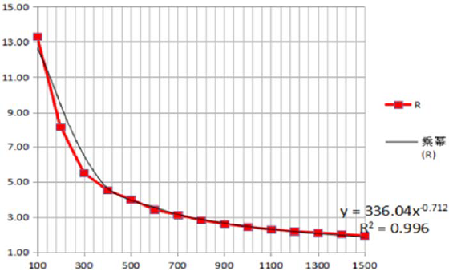
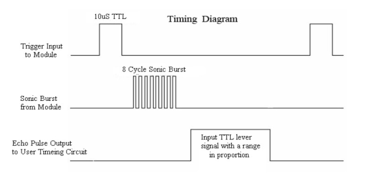
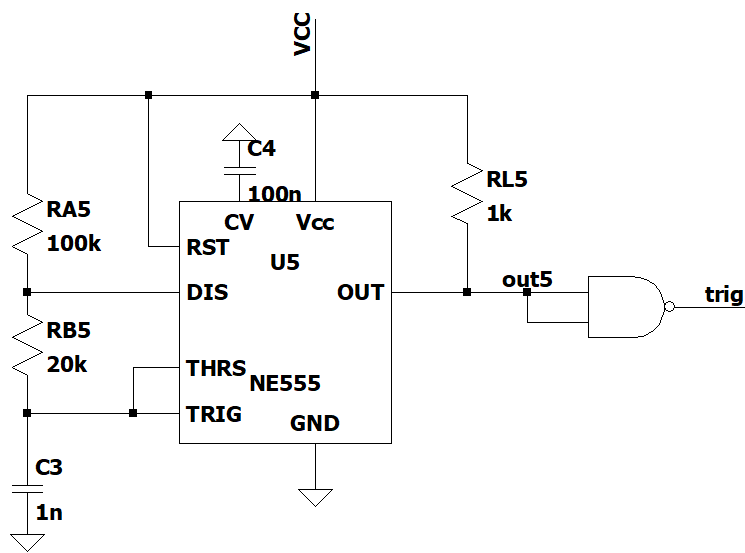
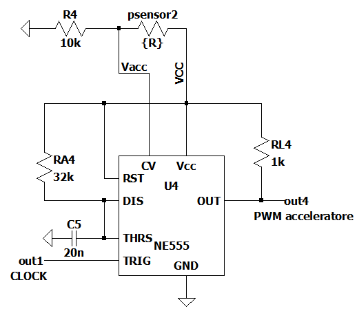
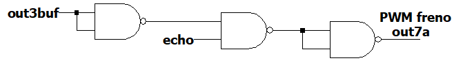
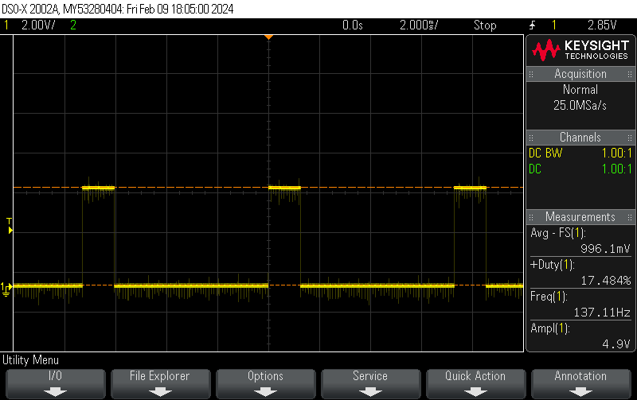
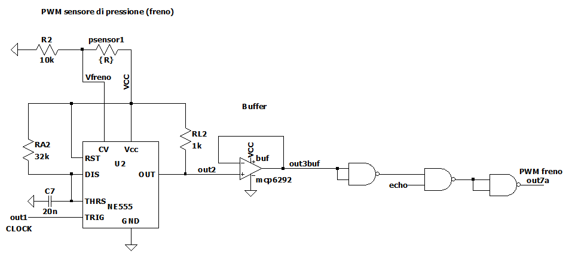
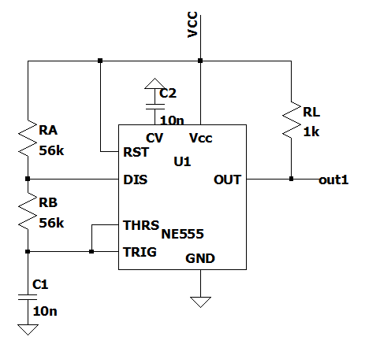
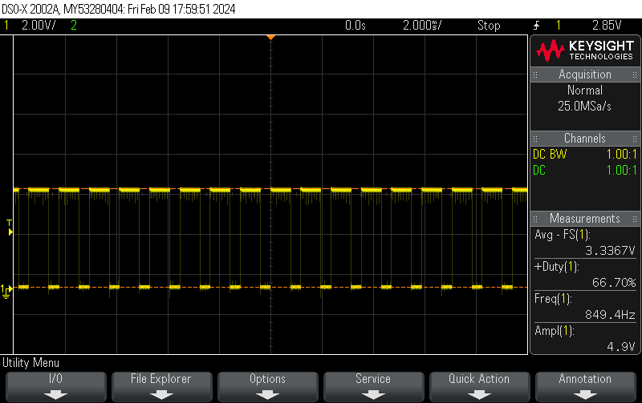
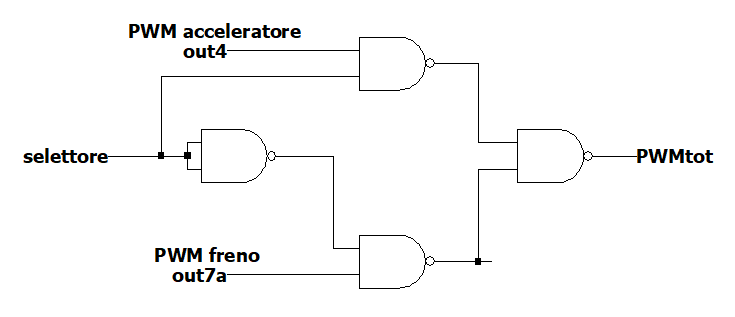

```{r setup, include=FALSE}
knitr::opts_chunk$set(echo = FALSE)
library(knitr)
library(kableExtra)
library(tidyverse)
library(memor)
library(patchwork)
library(latex2exp)
library(ggplot2)
library(modelr)
library(dplyr)
library(ggExtra)
library(boot)
library(outliers)
# Impostazioni output
knitr::opts_chunk$set(
	fig.align  = "center",        # allineamento figure
	fig.dim    = c(5, 3) * 1.2, # rapporto larghezza/altezza e fattore di scala
	#fig.show   = 'hold',
	#results    = 'hold',
	out.height = "2.8in",       # altezza effettiva figure
	message    = FALSE,         # sopprimi messaggi
	warning    = FALSE,         # sopprimi warning
	echo       = FALSE,          # mostra i codice dei chunk
	include    = TRUE,          # mostra l'output dei chunk
	tidy       = TRUE,          # formatta il codice dei chunk
  tidy.opts  = list(width.cutoff=I(60)) # massima larghezza codice nei chunk
)
```

# Introduzione

Con il circuito costruito l'obiettivo è quello di simulare un motore di una macchina capace di accelerare e di frenare, rispetto ad una velocità costante a vuoto, con due pedali, e, in caso di avvicinamento di un ostacolo, di rallentare fino ad arrestarsi quando questo è molto vicino.
I sensori utilizzati per realizzare questo circuito sono tre: due sensori di pressione e un sensore a ultrasuoni. I primi fungono da pedali, mentre il terzo da sensore di prossimità.

## Sensore di pressione *RP-C7.6-ST*
I due sensori utilizzati in questo circuito sono entrambi due *RP-C7.6-ST*. Questo tipo di sensore permette di determinare la forza esercitata su di esso conoscendo la sua resistenza. Man mano che la forza aumenta infatti la resistenza ai capi del sensore diminuisce. La funzione che meglio approssima l'effettiva relazione tra forza e resistenza è questa:
$$
  R = \frac{336.04}{F^{0.721}} 
$$
come raffigurato nella regressione del *data-sheet* in Fig.\ref{fig:regressione}.

```{r regressione, fig.cap="Regressione del sensore RP-C7.6-ST"}

```


## Sensore a ultrasuoni *HC-SR04*
Il sensore a ultrasuoni è un componente con quattro *pin* così chiamati:

- $V_{CC}$
- Trig
- Echo
- GND

Il primo e l'ultimo riguardano la tensione di alimentazione (rispettivamente $5V$ e massa), il trigger è responsabile dell'impulso da inviare verso l'esterno per intercettare eventuali ostacoli, l'echo invece tiene conto del tempo che trascorre tra l'invio del segnale e il suo ritorno.

Seguendo i dati del *data-sheet* questo sensore per funzionare ha bisogno di ricevere un impulso di circa $10\mu s$ (questo deve essere fornito esternamente, non lo crea da sé), e viene inviato dall'emettitore sotto forma di onda quadra sonora da 8 cicli a circa $40kHz$ (non udibile dall'essere umano). A questo punto il *pin* *echo* commuta ad una tensione al livello logico alto finché il ricevitore non rileva l'impulso di ritorno, dopo di ché torna al livello basso. Più vicino è l'oggetto e più breve è la durata del segnale alla tensione alta generato dall'*echo*, questo perché la differenza tra l'istante in cui l'impulso viene mandato dall'emettitore e quello in cui viene ricevuto è più piccola.

```{r pulse_echo, fig.cap="Impulsi del sensore a ultrasuoni"}

```

L'impulso di circa $10\mu s$ è generato dal circuito integrato n°5 (questi numeri sono relativi alla Fig.\ref{fig:circ_tot}), un multivibratore astabile che tuttavia non può scendere sotto il $50\%$ di *duty-cycle*, quindi per generare degli impulsi sufficientemente distanti tra loro basta creare un'onda quadra con un *duty-cycle* elevato per poi negarla (in Fig.\ref{fig:pulse_trig} è rappresentato lo schema del circuito insieme alla una porta NAND del *74HC00* n°7).  

```{r pulse_trig, fig.cap="Schema del generatore impulsi"}

```

# Circuito realizzato

```{r circ_tot, fig.cap="Circuito completo", out.height="20cm"}
knitr::include_graphics("immagini/circuito completo con nome.png")
```

## PWM acceleratore
Il ragionamento alla base del circuito sta nell'alimentare il motore con una tensione media che varia in funzione della tensione all'uscita dei sensori. Uno dei modi per ottenere questo risultato è tramite *PWM* (*Pulse with modulation*) con l'*NE555*.
Guardando la Fig.\ref{fig:schema_PWM}, che schematizza l'IC n°4 della Fig.\ref{fig:circ_tot}, si osserva che modificando la resistenza variabile (chiamata *psensor2*, ossia la resistenza del sensore di pressione) cambia la tensione $V_{acc}$ comune al *control voltage*. Fornendo un'onda quadra al *trig* del circuito integrato, e quindi cambiando la resistenza del sensore, si otterrà un'onda quadra con *duty-cycle* variabile. Più precisamente quando viene premuto il sensore, e quindi quando la resistenza diminuisce e $V_{acc}$ aumenta, cresce il *duty-cycle*. Questa funzione è perfetta per l'acceleratore (in quanto aumentando il *duty-cycle* aumenta la tensione media)

```{r schema_PWM, fig.cap = "Generatore PWM acceleratore"}

```


## PWM freno

Per quanto riguarda il freno, invece, è necessaria la funzione opposta, per questo serve un *NE555* separato che possa realizzare il *PWM* con *duty-cycle* decrescente. Il circuito è identico a quello dell'acceleratore, tuttavia in questo caso bisogna negare l'uscita per ottenere la funzione desiderata (in Fig.\ref{fig:schema_freno} è raffigurato lo schema del circuito del freno corrispondente all'integrato numero 2). Inviare il segnale in uscita dall'*NE555* direttamente alla porta logica però, a causa dell'elevata impedenza in uscita, ridurrebbe l'ampiezza del segnale, perciò per evitare questo problema è stato montato un buffer con il circuito integrato *MCP6292*, in Fig.\ref{fig:circ_tot} è la parte sinistra del numero 3.

Per ridurre la velocità del motore quando un oggetto si avvicina al sensore ad ultrasuoni, invece, la questione è meno complicata. Come spiegato nel capitolo precedente, dal *pin echo* vengono generati degli impulsi più o meno lunghi, a seconda della distanza dell'oggetto. Quando questo è molto vicino, l'onda risultante, nel suo insieme, avrà un *duty-cycle* più vicino a $0\%$, quindi con tensione media molto bassa, come in Fig.\ref{fig:PWM_ultrasuoni}. 

Affinché il motore possa rallentare sia nel caso in cui venga premuto il sensore di pressione, e sia nel caso in cui si avvicini un ostacolo al sensore a ultrasuoni è possibile effettuare un *AND* tra i due PWM. In tal modo quando almeno uno dei due sensori si attiva il *PWM* risultante ha un *duty-cycle* più piccolo.

```{r PWM_freno, fig.cap = "Schema realizzazione PWM del freno"}

```

```{r PWM_ultrasuoni, fig.cap="PWM sensore ultrasuoni con mano vicina"}

```

```{r PWM_freno_tot, fig.cap="Schema complessivo del PWM del freno"}

```


## Clock per gli NE555

Entrambi i circuiti integrati hanno però bisogno di un *clock* in *input* al trigger, e questo viene realizzato dal primo circuito integrato, di nuovo un multivibratore astabile con l'*NE555*, il cui schema è rappresentato in Fig.\ref{fig:schema_clock}, il clock in uscita da questo integrato è riportato in Fig.\ref{fig:clock}.

```{r schema_clock, fig.cap = "Generatore clock per gli NE555"}

```

```{r clock, fig.cap = "Generatore clock per gli NE555", fig.width = "15cm"}

```


## Multiplexer

Uno degli ultimi passi per far funzionare correttamente il circuito consiste nel selezionare il *PWM* corretto da mandare al *driver* del motore. Questa funzione può essere svolta da un *multiplexer*: un selettore infatti sceglie quale dei due segnali connettere all'uscita, il circuito è realizzato con l'intero IC *74HC00*, ed è schematizzato in Fig.\ref{fig:mux}.

```{r mux, fig.cap = "Schema multiplexer"}

```
Dallo schema si deduce che se il selettore è al livello logico basso allora viene selezionato l'acceleratore, viceversa se il selettore è al livello alto viene selezionato il freno.

Per realizzare questa operazione basta prelevare la tensione $V_{acc}$ dal partitore con il sensore di pressione e passarla attraverso un comparatore (come mostrato in Fig.\ref{fig:comparatore}) con una soglia poco superiore a $V_{CC}/2$ che renda digitale il segnale. In questo modo quando viene premuto il sensore dell'acceleratore $V_{acc}$ cresce e supera la soglia, così, grazie anche al *multiplexer*, il rispettivo *PWM* viene passato al driver. Invece se non viene premuto quel sensore il segnale connesso al driver è di norma quello del freno.


## Driver

La corrente 


# Potenza assorbita


